<h1 align="center">
  
  >𝐇𝐞𝐥𝐥𝐨 𝐭𝐡𝐞𝐫𝐞, 𝐟𝐞𝐥𝐥𝐨𝐰 <𝚌𝚘𝚍𝚎𝚛𝚜/>!
  
</h1>

<p align="center">
  <a href="https://github.com/lpsm-dev?tab=repositories&sort=stargazers">
    
  </a>

  <a href="https://github.com/lpsm-dev">
    
  </a>

  <br>
  <br>

  
</p>

<p align="center">
[ <a href='https://github.com/lpsm-dev/lpsm-dev/issues/new'>Ask a question</a> ] ||
[ <a href='https://github.com/lpsm-dev/lpsm-dev/issues?q=is%3Aissue+is%3Aclosed'>Read questions</a> ]
</p>

<p align="center">
  <samp>👇 Hit in your console or terminal to connect with me:</samp>
  <p align="center">
    <code>npx lpsm-dev</code>
  </p>
</p>

<h1 align="center">Intro</h1>

<p>
  <samp>
    Enthusiast, explorer and lover of DevOps culture, automation and Cloud. With several years of experience in the consulting and services industry, I'm currently working with cloud infrastructure, specifically AWS and container orchestration using Kubernetes. My skill set also includes Continuous Integration and Continuous Deployment (CI/CD) with tools like GitLab CI, GitHub Actions, and Azure DevOps. I'm involved in platform engineering with Backstage, managing secrets, and using Infrastructure as Code (IaC) with Terraform. I also monitor systems and work with other exciting techs.
  </samp>
</p>

<h1 align="center">About me</h1>

```Go
package main

import "fmt"

type Bio map[string]string

func main() {
    for k, v := range GetBio() {
        fmt.Printf("%+v: %+v\n", k, v)
    }
}

func GetBio() Bio {
    return Bio{
        "- 🔭 I'm currently working on":      "NuageIT as a DevOps Engineer",
        "- 🌱 I'm currently learning":        "Rust, Blockchain, CyberSecurity",
        "- 👯 I'm looking to collaborate on": "New solutions and open-source projects",
        "- 🤔 I'm looking for help with":     "Anything related to what I am currently learning 😅",
        "- 💬 Ask me about":                  "Ask me about anything that you want!",
    }
}
```

<h1 align="center">Techs</h1>

<p align="center">
  

  <br>
  <br>

  <samp>
    CLI Development (Golang, Python), Programming script (Ruby, Shell Script, PowerShell), Backend develop with Flask/NodeJS, SQL with Postgres/MySQL/MariaDB, NoSQL with MongoDB/Redis/ArangoDB, Message Broker with RabbitMQ/Mosquitto, DevOps with GitLab CI/GitHub Actions/Azure Devops, Cloud providers AWS/GCP, Observability with ELK/EFK/Graylog, Monitoring with Zabbix/Prometheus/Grafana, IAC with Terraform/Crossplane/Packer/Ansible, Docker and Cloud Native Buildpacks, Kubernetes/Rancher/Helm.
  </samp>
</p>

<p align="center">
  
  
  
  
  
  
  
  
  
  
  
</p>

<h1 align="center">Repos</h1>

<p align="center">
  <a href="https://github.com/lpsm-dev/docker-crypto-miner">
    
  </a>

  <a href="https://github.com/lpsm-dev/drprune">
    
  </a>
</p>

<p align="center">
  
</p>

<p align="center">
  
</p>

<p align="center">
  <a href="https://github.com/lpsm-dev/auto-earn-pre">
    
  </a>

  <a href="https://github.com/lpsm-dev/gex">
    
  </a>

</p>

<p align="center">
  <a href="https://github.com/lpsm-dev?tab=repositories">
    
  </a>
</p>

<h1 align="center">Open Source Contributions</h1>

- [Google GitHub SDk] - [Add pagination options to list all package versions](https://github.com/google/go-github/pull/2250)


<h1 align="center">Badges</h1>

<p align="center">I'm always excited to learn about new technologies! Here are some of the certifications and skill badges I've earned:</p>


<div align="center">
<!-- AWS Certified Cloud Practitioner -->
<a href="https://www.credly.com/badges/b0c0fcc0-dffa-4bcc-9bdb-1c1f0f6101b2/public_url">
  
</a>

<!-- AWS Certified AI Practitioner -->
<a href="https://www.credly.com/badges/ddb545d2-3044-4eb7-b48a-f3f4b07df8ee">
  
</a>

<!-- AWS Certified SysOps Administrator – Associate -->
<a href="https://www.credly.com/badges/028637d3-b11e-42c5-bae0-73f08afb8f4b/public_url">
  
</a>

<!-- AWS Certified Solutions Architect – Associate -->
<a href="https://www.credly.com/badges/eba53ed6-5eb4-4f15-8b8d-fb8e30288a5e/public_url">
  
</a>

<!-- KCNA: Kubernetes and Cloud Native Associate -->
<a href="https://www.credly.com/badges/26d70dd2-b56b-4341-8131-8834b37bc666/public_url">
  
</a>

<!-- CKAD: Certified Kubernetes Application Developer -->
<a href="https://www.credly.com/badges/8911adbe-a95b-492a-8ec7-22658435aff1/public_url">
  
</a>
</div>

<div align="center">
<!-- HashiCorp Certified: Terraform Associate (002) -->
<a href="https://www.credly.com/badges/1efaf3e3-2681-435e-ab88-49d1f00e8ff7/public_url">
  
</a>
  
<!-- CAPA: Certified Argo Project Associate -->
<a href="https://www.credly.com/badges/4a69cc85-24c0-49d5-a580-f31c23aaec1b/public_url">
  
</a>
  
<!-- SC102: Source Control Management with Git -->
<a href="https://www.credly.com/badges/9a43b812-c467-49aa-b584-59ee8a808d2e/public_url">
  
</a>

<!-- GitHub Foundations -->
<a href="https://www.credly.com/badges/7f10e522-85f3-4b0b-8a24-9e021965355a/public_url">
  
</a>
</div>


<h1 align="center">Metrics</h1>

<details align="center">
<summary>General</summary>
<p align="center">



</p>
</details>

<details align="center">
<summary>Activity</summary>
<p align="center">

[](https://github.com/ashutosh00710/github-readme-activity-graph)

</p>
</details>

<br>

<div align="center">


</div>

<br>

<p align="center">
  <samp>
    <b>
      I love new connections!</b> So if you want to say <b>hi, I'll be happy to meet you!
    </b>
  <samp>
</p>
